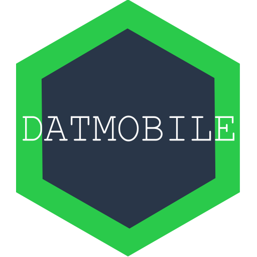

# Datmobile [(download)](https://play.google.com/store/apps/details?id=com.datmobile)

A mobile app for viewing Dat Archives. Drive all around the P2P web with your phone. Pronounced like the famous hero's car.

## Plans:

- [x] Set up RN project (Start with Android for now)
- [ ] Get hyperdrive running in RN
	- [x] Get node builtin modules working [rn-nodeify](https://github.com/tradle/rn-nodeify)
- [x] Get hyperdrive replicating with dat-gateway through websockets
- [ ] Make a viewer similar to [dat-js-example](https://github.com/RangerMauve/dat-js-example)
	- [x] Load Dat from URL bar
	- [x] View with some default URLs to visit
	- [x] Directory listing
	- [x] View text files in a Text element
	- [x] Image viewing
	- [x] Markdown support through some component
	- [x] HTML viewier with a webview (Won't support relative URLs or dat://protocol)
	- [x] Make it actually work on the device without remote debugging 😭 Thanks @mafintosh!
- [x] Release to playstore
- [x] Get discovery-swarm to work with RN in the JS thread
	- [x] dat-dns
	- [x] Identify the node modules that need to run in RN
	- [x] Use discovery-swarm instead of gateway
		- [x] Test dns tracker functionality
		- [ ] Test DHT (Bootstraps into the DHT, doesn't find peers)
		- [ ] Test MDNS
- [ ] Support dat protocol as a browser
	- [x] Find how to support custom protocols in Webview (Android)
		- [x] [shouldInterceptRequest](https://developer.android.com/reference/android/webkit/WebViewClient.html#shouldInterceptRequest(android.webkit.WebView,%20android.webkit.WebResourceRequest))
		- [x] Add a `registerStreamProtocol` API based on [electron's protocol API](https://electronjs.org/docs/api/protocol#protocolregisterstreamprotocolscheme-handler-completion)
		- [x] Follow guide for [customizing react-native-webview](https://github.com/react-native-community/react-native-webview/blob/master/docs/Custom-Android.md)
		- [x] Create Java ReactNativeProtocolViewManager
			- [x] Custom WebViewClient to intercept requests
			- [x] Extend RNCWebView commandMap with commands for sending responses
			- [x] Generate events for intercepting requests
			- [x] Add props for protocol scheme list
		- [x] Create ProtocolWebView JS API
			- [x] static `registerProtocol` and `unregisterProtocol`
			- [x] pass list of protocols to native props
			- [x] add an event listener for intercepted requests to use the protocol handlers
		- [x] Test it out with a dummy protocol
	- [ ] Create custom native WebView component which adds support for this functionality
	- [x] Create DatWebview which adds support for `dat://` protocol
	- [ ] Make browser UI with the new webview, replacing the viewer functionality
	- [ ] Support version portion of `dat://` URL
- [ ] Keep track of history and view / clear it
- [ ] DatArchive API
- [ ] Extract WebView into own library
- [ ] Extract Dat mechanics into `react-native-dat`
- [ ] Extras!
	- [ ] experimental.datPeers API
	- [ ] Add Blocklist for trackers and ads
- [ ] Perormance improvements
	- [ ] Close repos when they're not in use
	- [ ] Don't upload to discovery-swarm while on battery
	- [ ] Download bookmarked site updates when charging and not on metered wifi
	- [ ] Keep an LRU of archies to seed in the background
	- [ ] Prioritize local network over internet
	- [ ] [DNS caching](https://github.com/datprotocol/DEPs/pull/59)

## Contributing:

- Changes are very much welcome!
- Please open an issue if you have an idea for a big change before doing a PR.
- Please use the ["standard"](https://standardjs.com/) code style.

## Building

- `npm install`
- `npm run nodeify`
- `react-native link react-native-randombytes`
- `react-native link react-native-tcp`
- `react-native link react-native-udp`
- `react-native link react-native-os`
- `react-native link react-native-webview`
- `react-native run-android`

## Privacy:

Datmobile does not collect or save any of your personal data, or share it with third parties.
